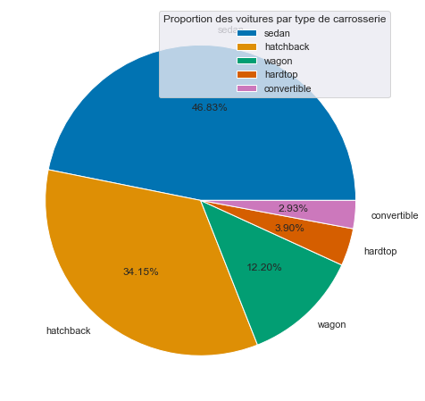
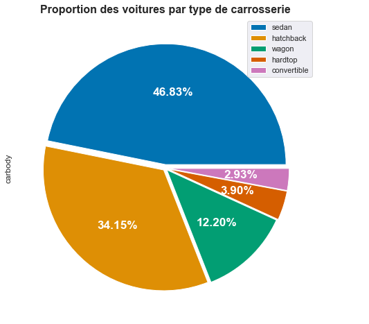
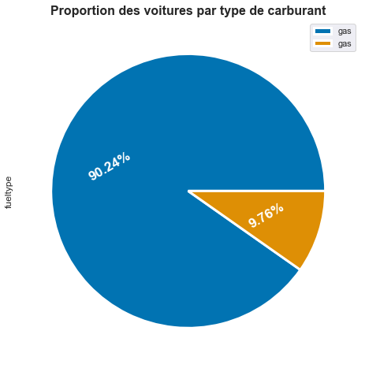

# Pie Chart

Dataset CarPriceAssignment

## Afficher la proportion de voiture par type de carrosserie
Pour afficher le graphique ci-dessous nous avons utilisé de deux liste:
* Le nom de chaque type de carrosserie (label)
* La proportion de voiture pour chaque type de carrosserie.

 

## Afficher la proportion de voiture par type de carburant
le graphique ci-dessous affiche la proportion de voiture par type de carburant.

Vous trouverez le tutoriel complet [ici](https://blog.sinatechnologie.com/graphique-a-barres)
 
